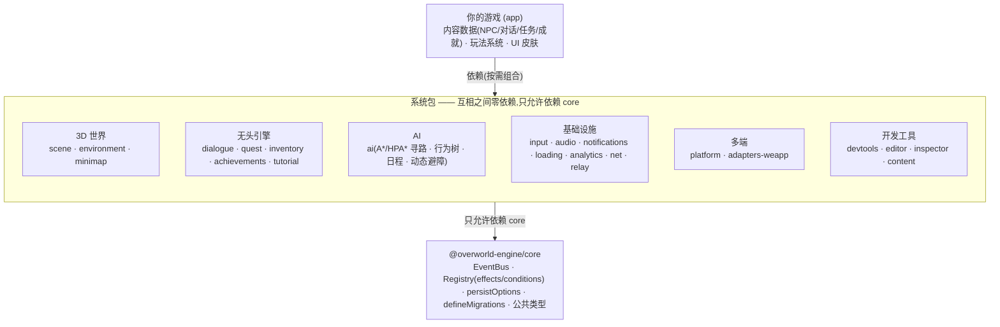
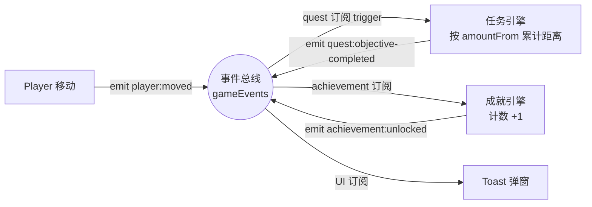

## 分层与依赖方向

一条铁律:**系统包之间禁止 import,只能通过 `core` 的事件总线与注册表间接协作**;
所有系统包只允许依赖 `@overworld-engine/core`。这条规则针对一个常见的耦合陷阱:一旦任务
store 直接 import 各玩法 store,任务系统就和具体游戏焊死、无法脱离该游戏复用。



全部 23 个包按上图分层。逐包 API 见「包参考」,完整版本演进见[版本历史](/docs/changelog)。

## 三种解耦机制

### 1. 类型化事件总线(EventBus)

`@overworld-engine/core` 导出全局单例 `gameEvents`(测试时自建 `EventBus` 实例注入)。
框架事件表 `OverworldEventMap` 覆盖玩家移动、场景、对话、任务、物品、成就、教程、
生命周期(`app:*`)等;游戏用 declaration merging 扩展自己的玩法事件,享受同样的类型安全。

典型链路——四个系统零相互引用,全靠总线串起来:



### 2. 条件/效果注册表(Registry)

内容数据里的行为全是声明式引用,不写代码:

```ts
// 任务奖励(纯数据)
rewards: [{ type: 'wallet.addGold', params: { amount: 100 } }]
// 游戏启动时(代码)
effects.register('wallet.addGold', (params) => wallet.add(params.amount as number))
```

`runEffects` 按序执行、未注册的 type 打 warning 跳过(内容错误不崩游戏);
`evaluateConditions` AND 语义、空数组为 true、未注册条件 fail closed。
任务引擎因此永远不 import 玩法代码。

### 3. 内容注入(工厂函数)

每个引擎是 `createXxx(config)` 工厂,内容(任务表、对话树、成就表)从 config 注入,
支持运行期增量注册(`registerQuests` 等)。存档统一走 `persistOptions`
(key 前缀 `overworld:`、版本化迁移、存储后端可替换);`defineMigrations` 辅助演进存档结构;
内容包(`@overworld-engine/content` 的 `applyContentPack`)可校验门控后热更新注入。

## 能力地图(截至 v1.5)

| 能力 | 包 / API |
|---|---|
| 数据驱动 3D 场景 | scene:`SceneShell` · `Player` · 碰撞/邻近 · `SceneFromJson`(从编辑器 JSON 出图) |
| 无头引擎 | dialogue · quest · inventory · achievements · tutorial(纯状态+逻辑,UI 由游戏决定) |
| AI 与寻路 | ai:A*/HPA* · 巡逻/游荡/跟随/goTo · 行为树 · 昼夜日程 · 动态避障 |
| 联机 | net:Transport(内存/BroadcastChannel/WebSocket)· presence 插值 · 输入预测对账;relay 中继服务器 |
| 多端 | platform:检测/桥/`app:*` 生命周期;adapters-weapp:微信小游戏 3D(R3F canvas root · 指针拾取 · useGLTF) |
| 存档 | core:`persistOptions` · `createSaveSlots` · `createRestStorage` · `defineMigrations`;platform:Tauri 文件 / Telegram CloudStorage |
| 开发工具 | devtools:内容校验 · JSON Schema · 事件剖析;editor:场景/多关卡编辑器;inspector:事件总线/store 实时面板;content:内容包热更新 |
| 确定性 | 全家桶可注入 `clock`/`scheduler`/`random`/`events`,同 seed 重放全等(防作弊/自动化测试) |

## 存档与多端策略

存档全框架统一约定:`persist` 省略/`false` = 关闭,`true` = 默认,传对象 = 自定义。
多存档位用 `createSaveSlots`;云存档/文件存档换 `StateStorage` 适配器即可。
多端为「一套 Web 代码 + 平台桥 + 微信适配层」,壳 SDK 只存在于端模板,框架包零硬依赖——
详见[多端支持](/docs/guides/platforms)。

## 测试策略

无头引擎在纯 Node 环境单测(注入独立 EventBus 与 memory storage);3D/联机/编辑器靠示例的
Playwright E2E 作为集成验收。store 驱动断言是官方推荐路径,详见[测试指南](/docs/guides/testing)。
