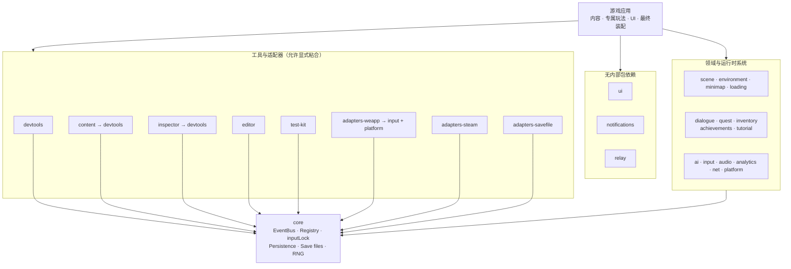
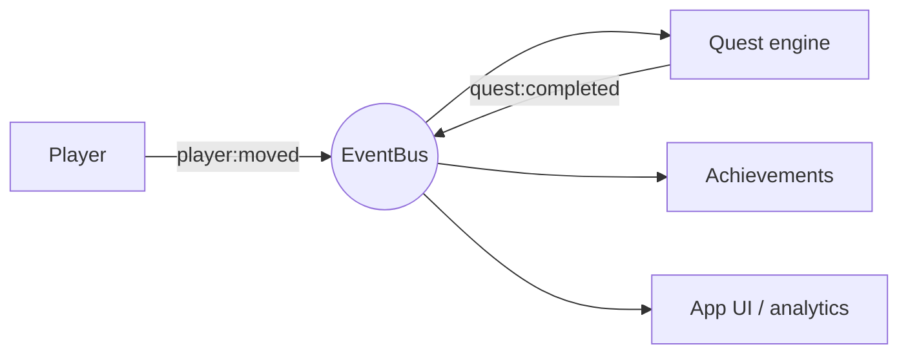
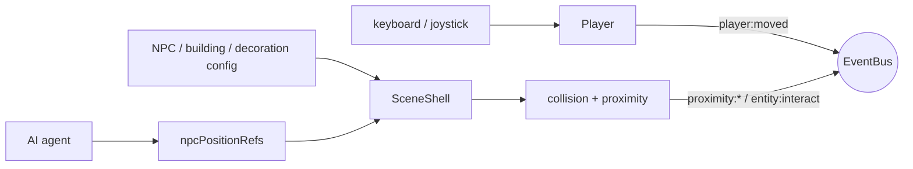

Overworld 的目标不是把所有游戏能力塞进一个引擎对象，而是让不同生命周期、
不同渲染方式、不同平台需求的系统可以独立采用。当前 `3.2.x` 发布线包含 27 个
包；本页的边界以各包 `package.json` 与 `src/index.ts` 为准。

## 依赖方向

大多数领域系统只依赖 `@overworld-engine/core`，不会直接导入另一个领域系统。
少量**工具与适配器**会明确组合它所服务的低层包：


```mermaid
flowchart TD
  App["游戏应用<br/>内容 · 专属玩法 · UI · 最终装配"]

  subgraph Domain["领域与运行时系统"]
    World["scene · environment · minimap · loading"]
    Gameplay["dialogue · quest · inventory<br/>achievements · tutorial"]
    Infra["ai · input · audio · analytics · net · platform"]
  end

  subgraph Independent["无内部包依赖"]
    UI["ui"]
    Notify["notifications"]
    Relay["relay"]
  end

  subgraph Tooling["工具与适配器（允许显式粘合）"]
    Devtools["devtools"]
    Content["content → devtools"]
    Inspector["inspector → devtools"]
    Editor["editor"]
    TestKit["test-kit"]
    Weapp["adapters-weapp → input + platform"]
    Steam["adapters-steam"]
    Savefile["adapters-savefile"]
  end

  Core["core<br/>EventBus · Registry · inputLock<br/>Persistence · Save files · RNG"]

  App --> Domain
  App --> Independent
  App --> Tooling
  Domain --> Core
  Devtools --> Core
  Content --> Core
  Inspector --> Core
  Editor --> Core
  TestKit --> Core
  Weapp --> Core
  Steam --> Core
  Savefile --> Core
```

上图省略了 React、three.js、zustand、`ws` 与 Tauri 等外部依赖，只展示
`@overworld-engine/*` 内部方向。完整 peer 矩阵见
[兼容性与支持范围](/docs/compatibility)。

### 这条边界解决什么

- 任务状态机不会因为项目换了背包、钱包或 UI 而重写。
- UI 通过 `*EngineLike` 结构类型接入引擎，不需要 import 真实引擎包。
- `scene` 不知道对话框是否打开，只查询共享 `inputLock`。
- 微信、Steam、Tauri 存档等适配器留在平台边缘，不污染领域模型。
- 测试可以给每个引擎注入独立事件总线、存储、时钟、调度器与随机源。

仓库用 dependency-cruiser 在 CI 中检查包边界。适配器和工具的例外是有意设计，
不是隐式耦合。

## 运行时的三种协作机制

### 1. 事件总线：描述“发生了什么”

`@overworld-engine/core` 导出类型化 `EventBus` 与默认单例 `gameEvents`。
玩家移动、任务完成、物品变化等跨系统事实通过事件传播：


```mermaid
flowchart LR
  Player["Player"] -->|"player:moved"| Bus(("EventBus"))
  Bus --> Quest["Quest engine"]
  Quest -->|"quest:completed"| Bus
  Bus --> Achievement["Achievements"]
  Bus --> UI["App UI / analytics"]
```

事件适合一对多通知与历史事实，不适合请求响应或长期状态读取。长期状态应从对应
引擎的 store 读取。

游戏可以通过 declaration merging 扩展同一张事件表：

```ts
declare module '@overworld-engine/core' {
  interface OverworldEventMap {
    'combat:damage': {
      sourceId: string
      targetId: string
      amount: number
    }
  }
}
```

生产应用通常共享 `gameEvents`；测试、服务器房间或多实例沙盒应创建独立
`EventBus<OverworldEventMap>` 并通过各引擎的 `events` 配置注入。

> 当前源码仍保留已弃用的无前缀 `interact` 事件，并由 `scene.interact()` 与
> `entity:interact` 双发。虽然旧注释曾计划在 2.0 移除，但 `3.2.x` 的实际公开
> API 仍包含它。新代码只订阅 `entity:interact`，不要依赖旧事件。

### 2. 条件与效果注册表：描述“如何判断、如何执行”

内容只保存可序列化引用：

```ts
rewards: [
  { type: 'wallet.addGold', params: { amount: 100 } },
]
```

应用装配点把名字映射到真实代码：

```ts
effects.register('wallet.addGold', (params) => {
  wallet.add(Number(params.amount))
})
```

条件是 AND 语义；空条件为 `true`；未知条件 fail closed。效果按顺序执行；
未知效果会警告并跳过。开发构建应使用 `devtools` 在运行前检查所有引用，避免把
警告留到玩家触发内容时才发现。

### 3. 结构类型与注入：描述“我需要什么能力”

包之间需要同步调用时，优先接受最小结构接口，而不是导入具体实现。例如 UI
组件只要求 `QuestEngineLike`，微信音频适配器只实现 `AudioBackend` 形状。
TypeScript 的结构类型让真实实现无需额外 wrapper 即可接入。

所有需要确定性或外部资源的系统都应从应用边缘注入：

| 变化来源 | 注入点示例 |
| --- | --- |
| 事件隔离 | `events: new EventBus()` |
| 随机性 | `rng: createSeededRng(seed)` 或 `{ next: Math.random }` |
| 时间 | `clock` |
| 延迟任务 | `scheduler` |
| 存储 | zustand `StateStorage` / `AtomicFileBackend` |
| 网络 | `Transport` |
| 音频 | `AudioBackend` |
| 平台 | `PlatformBridge` |

## 应用层是组合根

推荐把内容、注册表与引擎的相遇集中在一个 `game/engines.ts` 或工厂函数中：

```ts
export function createGameRuntime(deps: {
  events: EventBus<OverworldEventMap>
  rng: RngSource
}) {
  const conditions = createConditionRegistry()
  const effects = createEffectRegistry()

  const quests = createQuestEngine({
    quests: QUESTS,
    conditions,
    effects,
    events: deps.events,
    persist: false,
  })

  return { conditions, effects, quests }
}
```

组件文件负责渲染，内容文件只放定义，组合根负责：

1. 创建共享基础设施。
2. 创建引擎并注入内容。
3. 注册游戏专属条件与效果。
4. 连接必须的事件副作用。
5. 在开发环境执行内容校验。
6. 暴露明确的销毁函数，清理订阅、计时器和网络连接。

这种工厂形态也让测试可以每次创建全新的运行时，不泄漏全局 store 或监听器。

## 状态、事件与存档的边界

| 问题 | 应放在哪里 |
| --- | --- |
| “任务现在进行到多少？” | quest store |
| “任务刚刚完成了” | `quest:completed` 事件 |
| “完成时给 100 金币” | 内容中的效果引用 + 应用效果处理器 |
| “刷新后仍保留任务进度” | 引擎 `persist` 配置 |
| “存档格式从 v1 升到 v2” | `defineMigrations` |
| “桌面端断电也不能写坏存档” | `commitSlot` / `recoverSlot` + Tauri backend |

不要把事件总线当数据库，也不要在内容里嵌入闭包。前者会失去可查询状态，后者会
破坏序列化、热更和校验能力。

## 3D 世界的数据流

`scene` 负责渲染和玩家交互，但不拥有游戏全部真相：


```mermaid
flowchart LR
  Config["NPC / building / decoration config"] --> Scene["SceneShell"]
  Input["keyboard / joystick"] --> Player["Player"]
  Player -->|"player:moved"| Bus(("EventBus"))
  Agent["AI agent"] --> Ref["npcPositionRefs"]
  Ref --> Scene
  Scene --> Collision["collision + proximity"]
  Collision -->|"proximity:* / entity:interact"| Bus
```

移动 NPC 的位置可由 AI agent 更新到共享 ref，`SceneShell` 同步模型、碰撞体、
名牌与邻近检测。密集装饰物用一份实例数据同时派生渲染与碰撞，避免两套坐标漂移。
完整组合见[密集世界指南](/docs/guides/dense-world)。

## 公开 API 与兼容性

每个包的 `src/index.ts`（以及 `ui` 的公开子路径）是唯一支持的导入边界：

```ts
// 支持
import { createQuestEngine } from '@overworld-engine/quest'

// 不支持：dist/src 内部路径不是公共契约
import { createQuestEngine } from '@overworld-engine/quest/dist/engine'
```

27 个包采用 fixed version group，一次发布保持同一版本号。升级前阅读
[版本历史](/docs/changelog)；跨 major 升级参考[迁移指南](/docs/migration)。

## 能力地图（v3.2）

| 领域 | 主要包 / 能力 |
| --- | --- |
| 世界 | `scene`：SceneShell、Player、相机、碰撞、LOD、实例化装饰、编辑器 JSON 往返 |
| 环境与加载 | `environment`：昼夜天气；`loading`：阶段进度、区域流式加载 |
| 玩法 | `dialogue`、`quest`、`inventory`、`achievements`、`tutorial` |
| AI | A* / HPA*、steering、行为树、日程、动态避障 |
| 联机 | Transport、presence 插值、事件中继、输入预测对账、参考 relay |
| UI | HUD 原语、引擎绑定组件、战斗/导航组件、四套主题、空间焦点 |
| 平台 | Web、Telegram、Tauri、Capacitor、微信小游戏；Steam 与硬化存档适配 |
| 工具 | 内容校验、编辑器、事件/store inspector、内容包、应用层 test-kit |
| 确定性 | 独立 EventBus、可注入时钟/调度器/随机源、内存存储、事件录制 |
