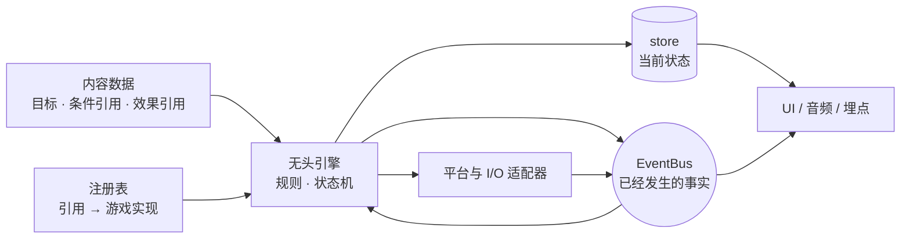

Overworld 的学习成本主要不在某个 API，而在于先分清**事实、状态、规则与实现**
分别属于哪里。本页给出阅读其他指南前需要的最小心智模型。

## 一张图看懂运行时



应用代码位于图的外层，负责创建这些对象、注入依赖并管理生命周期。框架不会替你
隐藏这个装配过程，因为平台能力、存档策略、游戏规则和发布目标都属于应用决策。

## 六个必须分清的概念

### 内容：可保存、可校验的“是什么”

任务、对话、物品和成就定义应是可序列化数据。内容可以保存 ID、数值和字符串引用，
但不应保存 store、React 组件或闭包：

```ts
{
  id: 'first-steps',
  objectives: [
    {
      id: 'walk',
      target: 20,
      trigger: { event: 'player:moved', amountFrom: 'distance' },
    },
  ],
  rewards: [
    { type: 'wallet.addGold', params: { amount: 50 } },
  ],
}
```

这样内容才能被 JSON Schema 校验、热更新、版本化和交给非程序人员维护。

### 注册表：字符串引用与游戏代码的边界

`wallet.addGold` 不是框架内置行为。应用在启动时把它映射到自己的实现：

```ts
effects.register('wallet.addGold', ({ amount }) => {
  wallet.add(Number(amount))
})
```

条件回答“现在是否允许”，效果执行“接下来做什么”。注册表让引擎不需要 import
钱包、关系、战斗等游戏专属系统。

### 引擎：规则与状态迁移

`quest`、`dialogue`、`inventory` 等无头引擎接收内容和依赖，执行自己的规则，
并暴露查询与 action。它们不决定你的视觉风格，也不拥有整个游戏状态。

### store：现在是什么状态

store 保存可查询的当前值，例如活跃任务、目标进度和背包内容。React 组件通过
selector 订阅它：

```tsx
const active = useStore(quests.store, (state) => state.active)
```

刷新页面需要恢复进度时，持久化的是 store 的受控切片，不是事件历史。

### EventBus：刚刚发生了什么

事件是已经发生的事实，例如 `player:moved` 或 `quest:completed`。一个事实可以被
任务、成就、音频、UI 和埋点同时观察，而发送方不需要知道观察者是谁。

事件不返回业务结果，也不是数据库。需要读取“任务现在进行到哪里”时，应查询 quest
store，而不是等待或重放 `quest:*` 事件。

### 组合根：所有依赖相遇的唯一位置

推荐在 `game/runtime.ts` 或 `game/engines.ts` 中完成：

1. 创建 EventBus、注册表、存储、随机源等基础设施。
2. 注册游戏专属条件与效果。
3. 创建引擎并注入内容。
4. 连接跨系统副作用。
5. 在开发环境校验内容。
6. 返回 `dispose()`，统一清理监听器、网络、计时器和音频。

组件负责渲染，内容文件负责定义，组合根负责接线。把这三类职责混在一个 React
组件里，通常是后期难以测试和迁移平台的起点。

## 该用事件、store，还是直接调用

| 需求 | 机制 | 原因 |
| --- | --- | --- |
| 玩家刚移动了 2 米 | EventBus | 已发生事实，可能有多个观察者 |
| 当前活跃任务列表 | store | 需要随时查询和订阅 |
| 检查玩家等级是否足够 | 条件注册表 | 内容只保留声明式引用 |
| 发放金币奖励 | 效果注册表 | 游戏实现留在应用层 |
| UI 调用“开始任务” | 引擎 action | 明确的一对一命令 |
| WebSocket、文件、Steam | adapter / bridge | I/O 和平台差异留在边缘 |

一个实用判断：如果调用方需要立刻得到返回值，它通常不是事件；如果数据需要在任意
时刻读取，它通常属于 store。

## 单例与实例

`gameEvents` 是方便单运行时应用的默认单例，但不是强制架构。以下场景应创建并注入
独立 EventBus：

- 单元测试和集成测试，避免监听器跨用例泄漏。
- 一个 Node.js 进程承载多个房间。
- 编辑器预览与真实游戏同时运行。
- 确定性回放或隔离沙盒。

同理，生产应用可以导出一个 runtime 单例；测试应调用工厂，每次得到全新的引擎、
store、随机源和清理函数。

## 生命周期与所有权

创建监听器、计时器、网络连接或音频上下文的代码，也应负责释放它们。推荐让组合根
返回一个幂等的清理入口：

```ts
export function createGameRuntime() {
  const stopAnalytics = gameEvents.on('quest:completed', trackQuest)
  const quests = createQuestEngine({ /* ... */ })

  return {
    quests,
    dispose() {
      stopAnalytics()
      quests.dispose()
    },
  }
}
```

开发环境热更新、测试重复运行和服务器房间销毁都会依赖清晰的所有权。

## 常见误区

- **“事件总线就是全局状态。”** 事件描述变化，store 保存结果；两者不能互相替代。
- **“无头就是不能配 React。”** 无头表示规则不绑定 UI；React 可以安全订阅 store。
- **“安装 `ui` 就会自动连接所有引擎。”** UI 通过结构类型接入，你仍需显式传入实例。
- **“使用默认单例更简单，所以测试也用它。”** 共享监听器会制造顺序依赖和偶发重复事件。
- **“平台检测通过就代表能力可用。”** 应查询 capability 或 bridge 方法是否存在。
- **“所有包版本接近就可以。”** 同一应用应让 `@overworld-engine/*` 保持相同 major/minor。

## 接下来

已经理解这张图后：

- 要做第一个闭环：回到[快速开始](/docs)。
- 要决定安装哪些能力：看[包选择指南](/docs/package-selection)。
- 要理解包之间允许怎样依赖：看[架构说明](/docs/architecture)。
- 要找具体导出和配置：进入[包参考](/docs/packages)。
